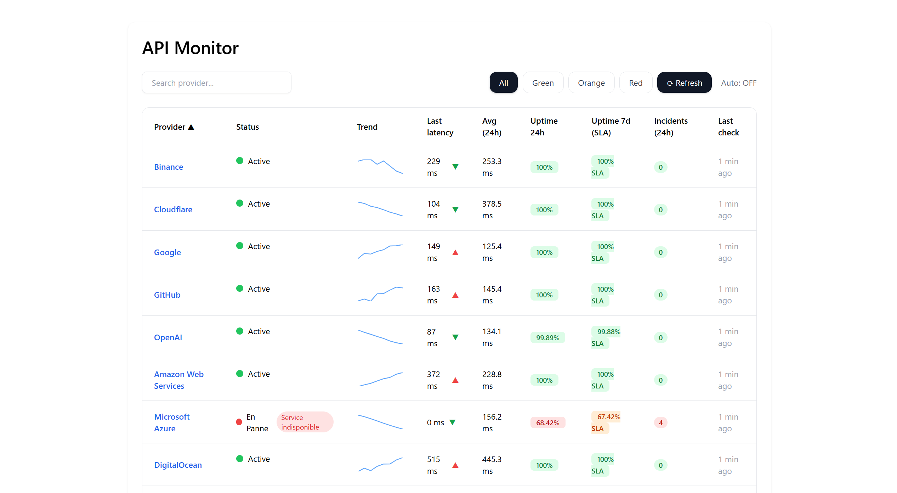
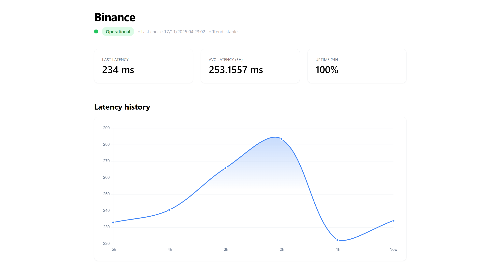
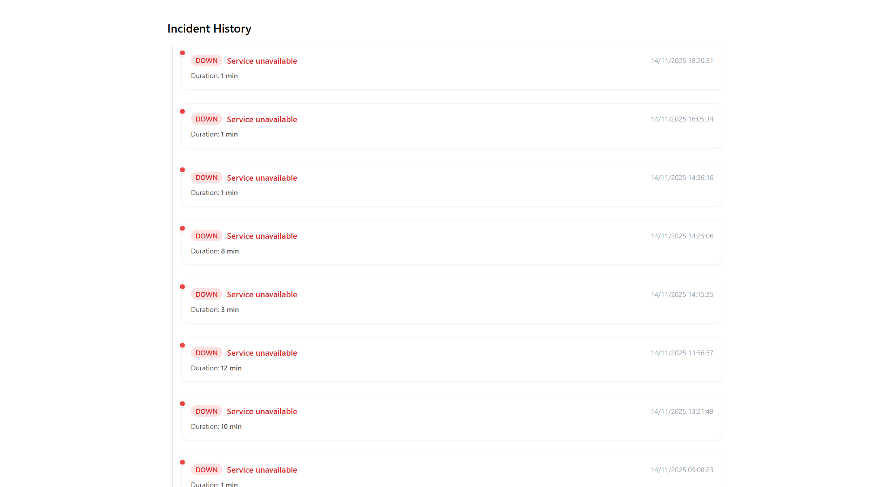

# API Verification Tower  
Système complet de monitoring d’API en temps réel : dashboard interactif, worker distribué et API backend unifiée.

API Verification Tower permet de suivre l’état de services externes, de détecter les incidents, d’afficher l’historique et de mesurer des métriques essentielles comme l’uptime ou la latence.

---

## Badges


---

## Démo et Screenshots

Démo :  
//

### Screenshots :
Vue générale du Dashboard


Détails d’un provider


Historique des incidents


---

## Fonctionnalités

### Dashboard
- Vue globale de tous les providers monitorés  
- Filtres par état (operational, degraded, down)  
- Recherche instantanée  
- Sparklines de tendances  
- Uptime, latence, incidents, SLA 7 jours  
- Page dédiée pour chaque provider

### Worker
- Exécute automatiquement les checks pour chaque endpoint  
- Mesure la latence, détecte les erreurs, analyse les réponses  
- Système d’incidents avec début et fin  
- Facile à scaler ou distribuer

### API Backend
- API REST avec Express  
- Prisma ORM + MySQL  
- Routes disponibles :
  - `/dashboard`  
  - `/providers/:slug`  
  - `/incidents/:providerId`  
  - `/checks`  

### Page Provider
- Statut complet (operational / degraded / down)  
- Graphique Chart.js : évolution de la latence  
- Liste des endpoints monitorés  
- Historique détaillé des incidents (durée, message, timestamps)

### Architecture Monorepo
- PNPM Workspaces  
- Apps : API, Worker, Dashboard Angular  
- Librairies internes : contracts, db, shared  
- Structure pensée pour évoluer rapidement

---

## Architecture (texte uniquement)

### Principe général

Le système repose sur trois composants majeurs :

1. **API Backend (Node + Prisma)**  
   Expose les données, orchestre les providers, stocke les résultats et incidents.

2. **Worker**  
   Vérifie les endpoints en continu, calcule les métriques, déclare les incidents.

3. **Dashboard Angular**  
   Interface utilisateur pour visualiser les données en temps réel.

Les données sont centralisées dans une base **MySQL**.

---

## Installation

### Prérequis
- Node.js 18+
- PNPM
- MySQL
- Prisma CLI

### Étapes

Cloner le projet :

```sh
git clone https://github.com/yhn-dm/tower-api-monitoring.git

cd tower-api-monitoring
```

Installer les dépendances :

```sh
pnpm install
```

Configurer l’environnement :

```sh
cp prisma/.env.example prisma/.env
```

Modifier ensuite la variable DATABASE_URL dans prisma/.env selon votre configuration MySQL.

Appliquer les migrations Prisma :

```sh
pnpm exec prisma migrate dev
```

Exécuter le seed initial :

```sh
pnpm exec ts-node prisma/seed.ts
```

Démarrage

API Backend :

```sh
pnpm -C apps/api dev
```

Worker :

```sh
pnpm -C apps/worker dev
```

Dashboard Angular :

```sh
pnpm -C apps/dashboard/dashboard start
```
